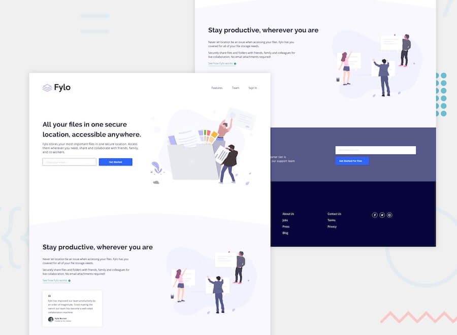
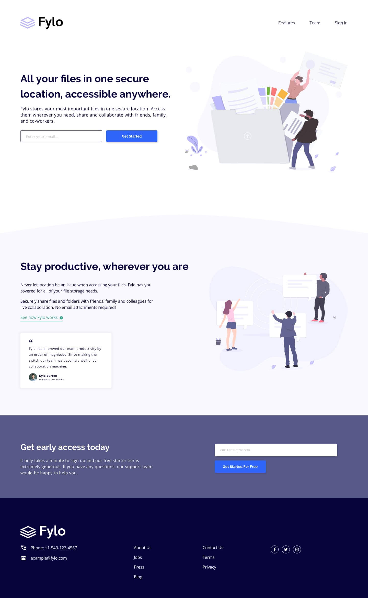
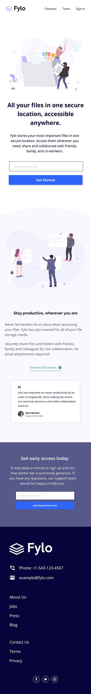

# Fylo landing page with two column layout

## Frontend Mentor

### live demo

[Fylo landing page with two column layout](https://marcinkisiel.github.io/frontend-mentor-fylo-landing-page/)

### opis

Jest to realizacja wyzwania z portalu **_[Frontend Mentor](https://www.frontendmentor.io/challenges/fylo-landing-page-with-two-column-layout-5ca5ef041e82137ec91a50f5)_**, w ramach którego trzeba przygotować landing page z dwukolumnowym layoutem w dwóch widokach. 
Realizując challenge nie bazuję na plikach projektu, ale korzystam z dołączonych niżej widoków w plikach **.jpg**, więc nie jest to rozwiązanie _pixel-perfect_.

### stan projektu

nieukończony

### czas realizacji projektu

maj 2020 - nadal

### technologie

HTML, CSS

### użyte narzędzia

Sass (SCSS)

### projekt graficzny

Frontend Mentor
 

### kontakt

**Marcin Kisiel**:
 
[kisiel.marcin@gmail.com](mailto:kisiel.marcin@gmail.com)
 
[LinkedIn](https://www.linkedin.com/in/marcin-kisiel/)
 
[GitHub](https://github.com/marcinkisiel)
 
